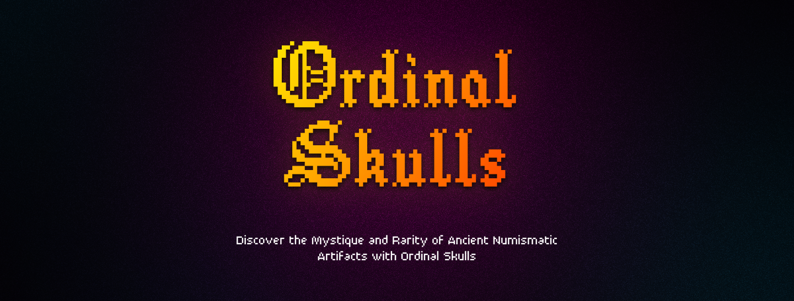

# Ordinal Skulls

🪙💀🏺

## Overview

Ordinal Skulls is a collection of high-quality collectible artifacts built on the Bitcoin network using the [Ordinals protocol](https://ordinals.com/). This website allows users to mint their own Ordinal Skull NFTs and become part of this unique and valuable collection.

The website is built with Next.js, a React framework for building server-side rendered applications.

## Requirements

To run this website locally, you will need to have Node.js installed on your machine. You can download Node.js here.

## Installation

To install the dependencies for this website, navigate to the root directory of the project in your terminal and run the following command:

```bash
npm install

# or

yarn install
```

This will install all of the required dependencies listed in the package.json file.

## Configuration

To configure the website, you will need to create a .env.local file in the root directory of the project. This file should contain the following environment variables:

```bash
NEXT_PUBLIC_WALLET # The address wallet that is used to recieve funds and send back ordinals
```

## Usage

To start the website, navigate to the root directory of the project in your terminal and run the following command:

```bash
npm run dev
```

This will start a local development server at http://localhost:3000. You can access the website by opening this URL in your web browser.
